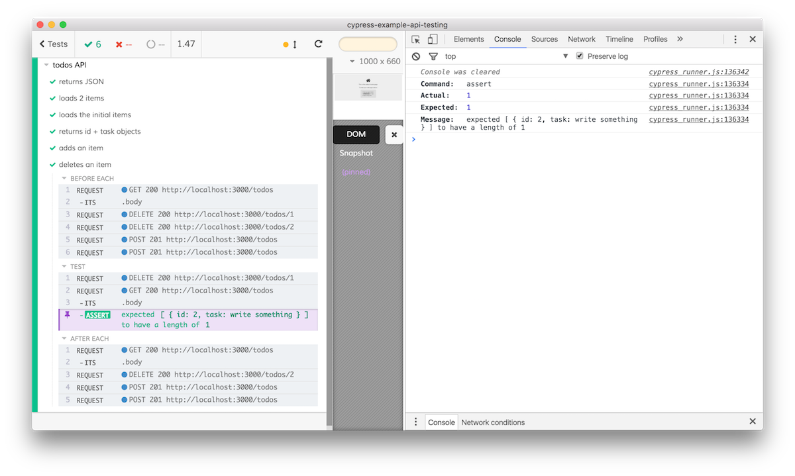

# cypress-example-api-testing

> [Cypress](https://cypress.op) E2E runner can also test Rest and other APIs

 [![renovate-app badge][renovate-badge]][renovate-app]

[renovate-badge]: https://img.shields.io/badge/renovate-app-blue.svg
[renovate-app]: https://renovateapp.com/

See related blog post [Add GUI to your E2E API tests](https://www.cypress.io/blog/2017/11/07/add-gui-to-your-e2e-api-tests/)

## Use

Install dependencies with `npm install` or `npm ci`

See scripts in `package.json` to start the local API server and run the tests. The main ones are

* `npm start` - runs the local API server
* `npm run cy:open` - runs Cypress in GUI mode
* `npm test` - starts the local API server and runs Cypress tests against it in headless mode
