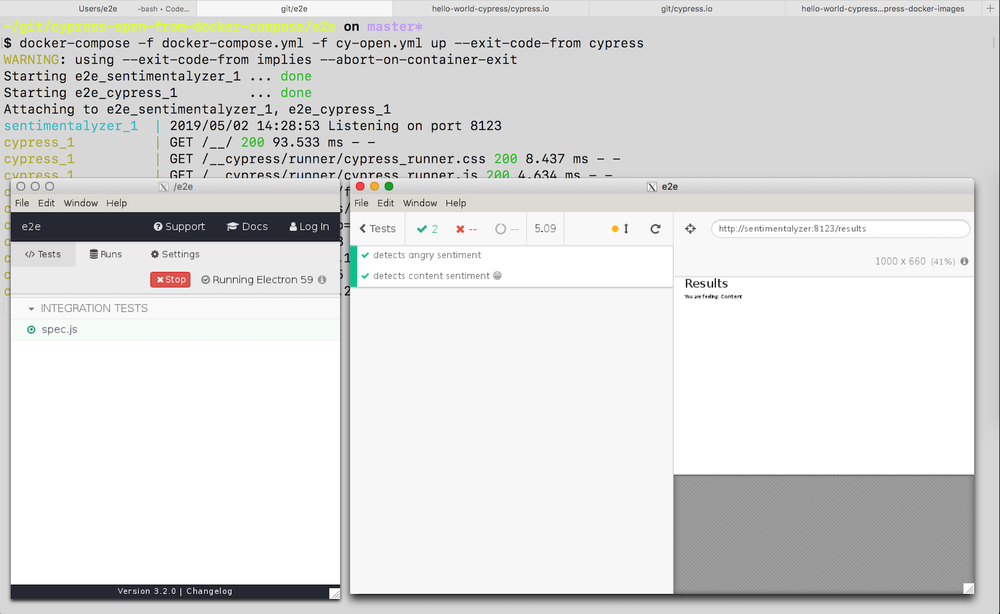

# cypress-open-from-docker-compose

Forked from [mtlynch/hello-world-cypress](https://github.com/mtlynch/hello-world-cypress) that allows to run a project and its Cypress end-to-end tests using docker-compose. The initial setup is well described in ["End-to-End Testing Web Apps: The Painless Way."](https://mtlynch.io/painless-web-app-testing/).

Also read ["Run Cypress with a single Docker command"](https://www.cypress.io/blog/2019/05/02/run-cypress-with-a-single-docker-command/).

## Run headless tests

[e2e/docker-compose.yml](e2e/docker-compose.yml) has all settings to start the web application and run Cypress end-to-end tests from [e2e/cypress/integration](e2e/cypress/integration)

```shell
cd e2e
docker-compose up --exit-code-from cypress
```

## Run Test Runner

To start Cypress Test Runner (just like `cypress open` does), you need to:

- set up X11 server on the host machine, for example using [XQuartz](https://www.xquartz.org) following the [Running GUI applications using Docker for Mac](https://sourabhbajaj.com/blog/2017/02/07/gui-applications-docker-mac/)
- set the `IP` variable and allow X11 server to accept incoming connections from that network address, see [e2e/cy-open.yml](e2e/cy-open.yml) for commands
- set the `DISPLAY` variable and pass it to the `docker-compose` when running with both configuration files

```shell
cd e2e
docker-compose -f docker-compose.yml -f cy-open.yml up --exit-code-from cypress
```

You should see Cypress open and be able to run tests, change files, see tests rerun.



## More information

- [https://docs.cypress.io](https://docs.cypress.io)
- [https://on.cypress.io/docker](https://on.cypress.io/docker)
